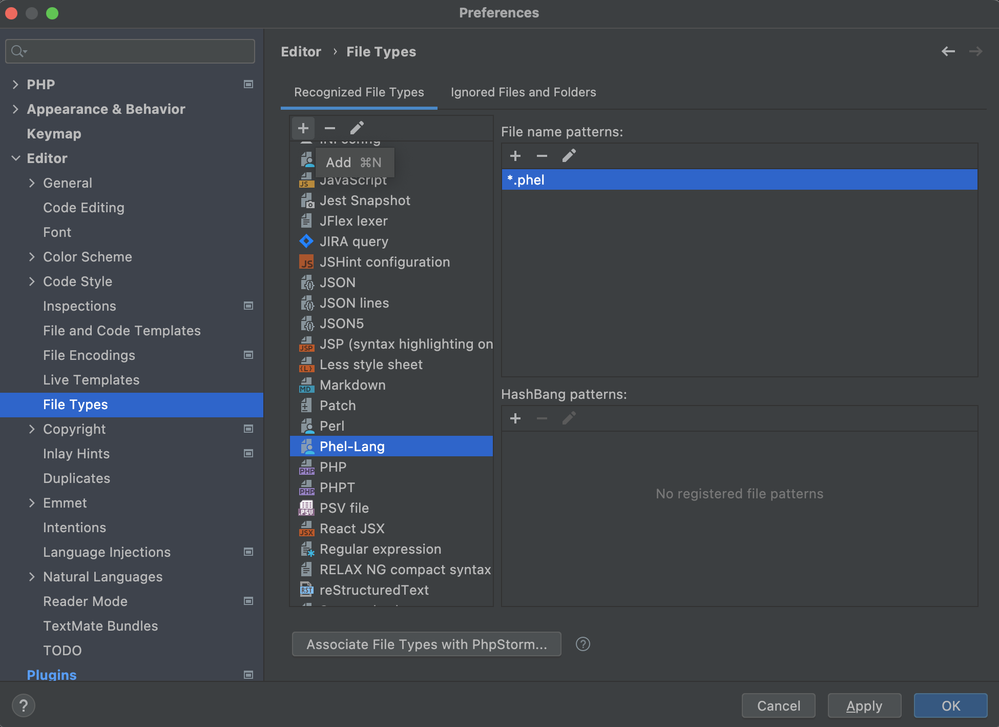
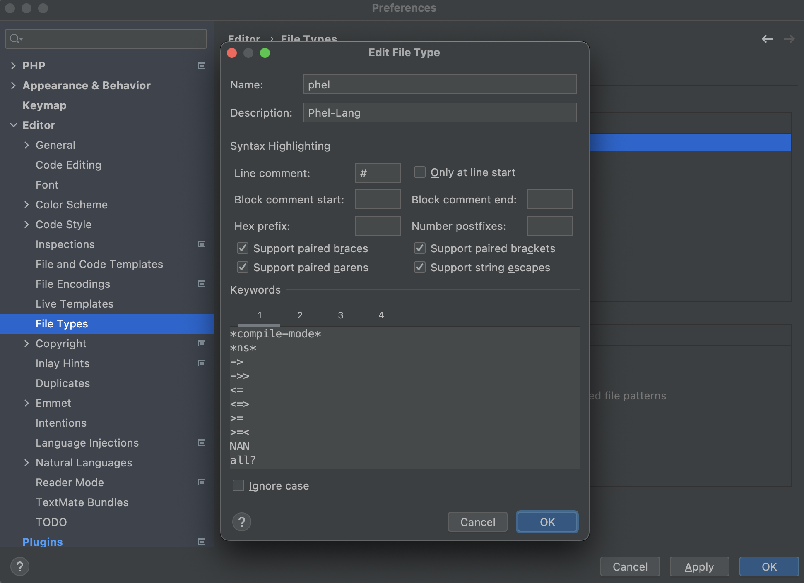

# phel-phpstorm-syntax

A guide to highlight phel syntax when using PhpStorm IDE

## Add the phel file type 

Go to: Preferences > Editor > File types

1) add a new file type for Phel-Lang: `phel`
2) to this new file type specify the file extension: `*.phel`
3) specify line comment: `#`
4) check support paired braces, brackets, parens, string escapes
5) provide the keywords in each tab




### Tab 1
```
**
*build-mode*
*compile-mode*
*ns*
->
->>
<
<=
<=>
>
>=
>=<
NAN
all?
and
apply
argv
as->
associative?
binding
bit-and
bit-clear
bit-flip
bit-not
bit-or
bit-set
bit-shift-left
bit-shift-right
bit-test
bit-xor
boolean?
case
coerce-in
comment
comp
compare
compile
complement
concat
cond
cons
contains-value?
contains?
count
create-response-from-map
create-response-from-string
dec
declare
decode
decode-value
deep-merge
def
def-
definterface
definterface*
defmacro
defmacro-
defn
defn-
defstruct
defstruct*
deftest
deref
difference
difference-pair
distinct
do
doctype
dofor
drop
drop-while
emit-response
empty?
encode
encode-value
escape-html
eval
even?
extreme
false?
ffirst
files-from-globals
filter
find
find-index
first
flatten
float?
fn
for
foreach
format
frequencies
full-name
function?
gensym
get
get-in
group-by
hash-map
hash-map?
headers-from-server
html
id
identity
if
if-not
inc
indexed?
int?
interleave
interpose
intersection
invert
is
juxt
keep
keep-indexed
keys
keyword
keyword?
kvs
let
list
list?
loop
map
map-indexed
mapcat
max
mean
merge
merge-with
meta
min
name
namespace
nan?
neg?
next
nfirst
nil?
nnext
not
not=
ns
number?
odd?
one?
or
pairs
partial
partition
peek
persistent
php-array-to-map
php-array?
php-associative-array
php-indexed-array
php-object?
php-resource?
pop
pos?
print
print-str
print-summary
printf
println
push
put
put-in
quote
rand
rand-int
rand-nth
range
raw-string
raw-string?
re-seq
read-string
recur
reduce
reduce2
remove
repeat
report
request
request-from-globals
request-from-globals-args
request-from-map
request?
response
response-from-map
response-from-string
response?
rest
reverse
run-tests
second
set
set!
set-meta!
set-var
set?
shuffle
slice
some?
sort
sort-by
split-at
split-with
str
str-contains?
string?
struct?
successful?
sum
swap!
symbol?
symmetric-difference
take
take-last
take-nth
take-while
throw
to-php-array
transient
tree-seq
true?
truthy?
try
type
union
unquote
unquote-splicing
unset
update
update-in
uploaded-file
uploaded-file?
uri
uri-from-globals
uri-from-string
uri?
valid-key?
values
var
var?
vector
vector?
when
when-not
with-output-buffer
zero?
zipcoll
```

### Tab 2
```
__DIR__
__FILE__
```

### Tab 3
```
:
::
:require-file
:require
:refer
:export
:use
:as
```

### Tab 4
```
@
'
,
`
php/
php/aget
php/apush
php/aset
php/aunset
php/new
php/->
php/::
php/oset
```
